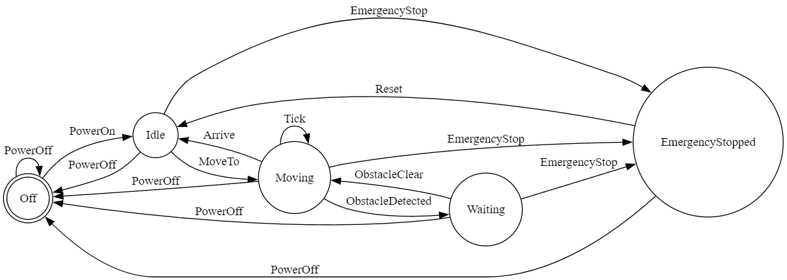

<h1 align="center">stateless</h1>

<p align="center">
  <a href="https://github.com/matthewjberger/stateless"></a>
  <a href="https://crates.io/crates/stateless"></a>
  <a href="https://github.com/matthewjberger/stateless/blob/main/MIT.md"></a>
</p>

<p align="center"><strong>A zero-cost state machine macro that separates structure from behavior.</strong></p>

<p align="center">
  <code>cargo add stateless</code>
</p>

Most state machine libraries couple behavior to the state machine itself. Guards, actions, and context structs all get tangled into the DSL. This makes the state machine hard to test, hard to refactor, and impossible to compose.

`stateless` takes the opposite approach: the macro is a pure transition table. It generates two enums and a lookup function. Guards, side effects, and error handling live in your own code, using normal Rust patterns. The state machine doesn't know your types exist, and your types don't depend on any framework trait.

## Quick Start

```rust
use stateless::statemachine;

statemachine! {
    transitions: {
        *Idle + Start = Running,
        Running + Stop = Idle,
        _ + Reset = Idle,
    }
}

let mut state = State::default(); // Idle (marked with *)
assert_eq!(state, State::Idle);

if let Some(new_state) = state.process_event(Event::Start) {
    state = new_state;
}
assert_eq!(state, State::Running);
```

`process_event` returns `Some(new_state)` if the transition is valid, `None` if not. This lets you insert guards and actions between checking validity and applying the transition.

## Generated Code

Given this DSL:

```rust
statemachine! {
    transitions: {
        *Idle + Start = Running,
        Running + Stop = Idle,
    }
}
```

The macro generates:

```rust
#[derive(Debug, Copy, Clone, PartialEq, Eq, Hash)]
pub enum State {
    Idle,
    Running,
}

impl Default for State {
    fn default() -> Self {
        State::Idle
    }
}

#[derive(Debug, Copy, Clone, PartialEq, Eq, Hash)]
pub enum Event {
    Start,
    Stop,
}

impl State {
    pub const ALL: &[State] = &[State::Idle, State::Running];
    pub const DOT: &str = "digraph { ... }";

    pub fn process_event(&self, event: Event) -> Option<State> {
        if matches!(*self, State::Idle) && matches!(event, Event::Start) {
            return Some(State::Running);
        }
        if matches!(*self, State::Running) && matches!(event, Event::Stop) {
            return Some(State::Idle);
        }
        None
    }

    pub fn valid_events(&self) -> &'static [Event] {
        match self {
            State::Idle => &[Event::Start],
            State::Running => &[Event::Stop],
        }
    }
}

impl Event {
    pub const ALL: &[Event] = &[Event::Start, Event::Stop];
}
```

## Features

### Guards and Actions

Guards and actions live in your wrapper code, not the DSL. Call `process_event` to check validity, verify your guards, perform side effects, then apply the state:

```rust
fn connect(&mut self, id: u32) {
    let Some(new_state) = self.state.process_event(Event::Connect) else {
        return;
    };

    if id > self.max_connections {
        return;
    }

    if self.battery < 5 {
        return;
    }

    self.connection_id = id;
    self.battery -= 5;
    self.state = new_state;
}
```

### Initial State

Mark the initial state with `*`. This state is used for the generated `Default` implementation:

```rust
statemachine! {
    transitions: {
        *Idle + Start = Running,  // Idle is the initial state
        Running + Stop = Idle,
    }
}

let state = State::default(); // State::Idle
```

### State Patterns

Multiple source states can share a transition:

```rust
statemachine! {
    transitions: {
        *Ready | Waiting + Start = Active,
        Active + Stop = Ready,
    }
}
```

### Event Patterns

Multiple events can trigger the same transition:

```rust
statemachine! {
    transitions: {
        *Active + Pause | Stop = Idle,
    }
}
```

### Wildcard Transitions

Transition from any state. Specific transitions always take priority over wildcards, regardless of declaration order:

```rust
statemachine! {
    transitions: {
        *Idle + Start = Running,
        _ + Reset = Idle,
    }
}
```

### Internal Transitions

Stay in the current state while performing side effects:

```rust
statemachine! {
    transitions: {
        *Moving + Tick = _,
        Moving + Arrive = Idle,
    }
}

impl Robot {
    fn tick(&mut self) {
        let Some(new_state) = self.state.process_event(Event::Tick) else {
            return;
        };

        self.movement_ticks += 1;
        self.state = new_state;
    }
}
```

### Variant Enumeration

`State::ALL` and `Event::ALL` list every variant as static slices. Useful for testing, serialization, and debug UIs:

```rust
statemachine! {
    transitions: {
        *Idle + Start = Running,
        Running + Stop = Idle,
    }
}

assert_eq!(State::ALL, &[State::Idle, State::Running]);
assert_eq!(Event::ALL, &[Event::Start, Event::Stop]);

for state in State::ALL {
    println!("{:?} accepts {:?}", state, state.valid_events());
}
```

### Valid Events

`valid_events()` returns the events that produce transitions from a given state. Wildcard transitions are included. Useful for UIs, help text, and validation:

```rust
statemachine! {
    transitions: {
        *Idle + Start = Running,
        Running + Stop = Idle,
        _ + Reset = Idle,
    }
}

assert_eq!(State::Idle.valid_events(), &[Event::Start, Event::Reset]);
assert_eq!(State::Running.valid_events(), &[Event::Stop, Event::Reset]);
```

Terminal state detection comes for free:

```rust
statemachine! {
    transitions: {
        *Start + Go = End,
    }
}

assert!(!State::Start.valid_events().is_empty());
assert!(State::End.valid_events().is_empty()); // terminal state
```

### DOT Graph Output

`State::DOT` is a `&str` const containing the [Graphviz DOT](https://graphviz.org/) representation of the transition table. The initial state is rendered as a double circle. Wildcard transitions are expanded to all applicable states, respecting specific-transition priority:

```rust
statemachine! {
    transitions: {
        *Idle + Start = Running,
        Running + Stop = Idle,
    }
}

println!("{}", State::DOT);
// digraph {
//   rankdir=LR;
//   node [shape=circle];
//   "Idle" [shape=doublecircle];
//   "Idle" -> "Running" [label="Start"];
//   "Running" -> "Idle" [label="Stop"];
// }
```

Paste the output into [GraphvizOnline](https://dreampuf.github.io/GraphvizOnline) to render it instantly, or pipe it locally:

```bash
echo 'PASTE_DOT_OUTPUT_HERE' | dot -Tpng -o states.png
```

Here's the DOT output from the [demo example](examples/demo.rs):

<p align="center"></p>

`DOT` is a `const` — if you never reference it, it has zero binary footprint.

### Custom Derives

Default derives are `Debug, Copy, Clone, PartialEq, Eq, Hash`. Override with `derive_states` and `derive_events`:

```rust
statemachine! {
    derive_states: [Debug, Clone, PartialEq, Eq, Hash],
    derive_events: [Debug, Clone, PartialEq],
    transitions: {
        *Idle + Start = Running,
    }
}
```

### Multiple State Machines

Use `name` for namespacing when you need multiple state machines in the same scope:

```rust
statemachine! {
    name: Player,
    transitions: {
        *Idle + Move = Walking,
    }
}

statemachine! {
    name: Enemy,
    transitions: {
        *Patrol + Spot = Chasing,
    }
}

// Generates: PlayerState, PlayerEvent, EnemyState, EnemyEvent
```

## Compile Time Validation

The macro validates your state machine at compile time:

- **Duplicate transitions**: same state + event pair defined twice
- **Multiple initial states**: more than one state marked with `*`
- **Empty transitions**: no transitions defined
- **Duplicate wildcards**: same event used in multiple wildcard transitions
```rust
statemachine! {
    transitions: {
        *A + Go = B,
        A + Go = C,  // ERROR: duplicate transition
    }
}
```

```
error: duplicate transition: state 'A' + event 'Go' is already defined
       help: each combination of source state and event can only appear once
       note: if you need conditional behavior, use different events or handle logic in your wrapper
```

## DSL Reference

```rust
statemachine! {
    name: MyMachine,                          // Optional: generates MyMachineState, MyMachineEvent
    derive_states: [Debug, Clone, PartialEq], // Optional: custom derives for State enum
    derive_events: [Debug, Clone, PartialEq], // Optional: custom derives for Event enum

    transitions: {
        *Idle + Start = Running,              // Initial state marked with *
        Ready | Waiting + Start = Active,     // State patterns (multiple source states)
        Active + Stop | Pause = Idle,         // Event patterns (multiple trigger events)
        _ + Reset = Idle,                     // Wildcard (from any state, lowest priority)
        Active + Tick = _,                    // Internal transition (stay in same state)
    }
}
```

## FAQ

**Q: Can I use this in `no_std` environments?**

A: Yes. The generated code uses only `core` types and traits and requires no allocator at runtime.

## Examples

See the [examples](examples/) directory for complete working examples:
- `demo.rs`: Robot control demonstrating guards, actions, state patterns, internal transitions, and wildcards
- `hierarchical.rs`: Hierarchical state machines using composition (player movement + weapon states)

```bash
cargo run -r --example demo
cargo run -r --example hierarchical
```

## License

This project is licensed under the MIT License. See the [MIT.md](MIT.md) file for details.
